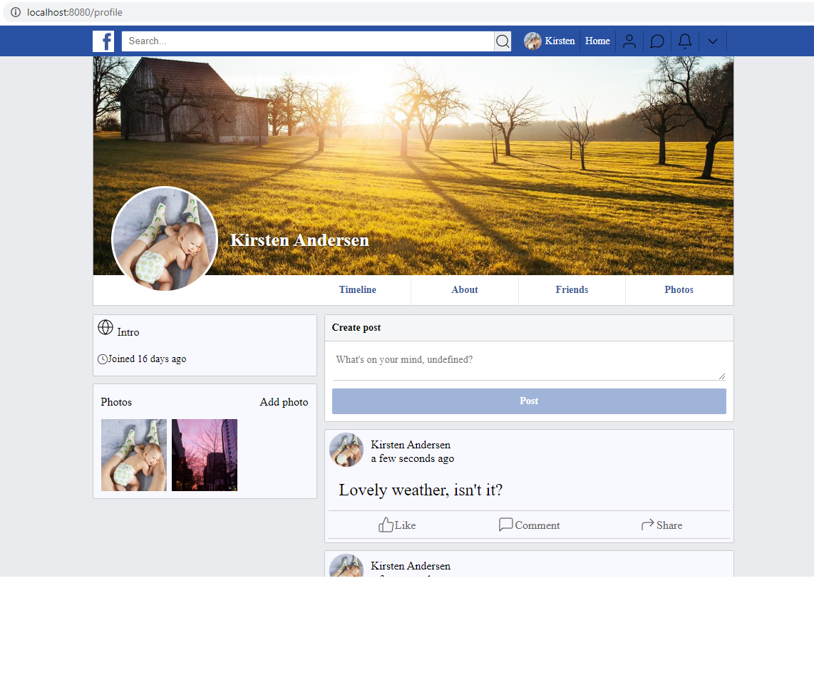

# Social Network

The social network project is a single-page application made with React,

Imagine a place where users can sign up, write something about themselves, and become friends with other users.

It uses Amazon Web Services' (AWS) Simple Storage Service (S3) to store the uploaded images.



## Installation

Clone the repository from https://github.com/kimskovhusandersen/Social-Network.git

cd into the directory and run

```
npm install

```

create a PostgreSQL database called "socialnetwork"

```
psql

create database socialnetwork;

```

Then configure the petition database by executing the config.sql file from the root directory

```
psql -d socialnetwork -f sql/config.sql
```

Create an AWS S3 Bucket.

Create a new file in the root directory named secrets.json and enter the following:

```
{
    "DB_USERNAME": "YOUR_POSTGRESQL_USERNAME",
    "DB_PASSWORD": "YOUR_POSTGRESQL_PASSWORD",
    "SESSION_SECRET": "YOUR SECRET SESSION PHRASE",
    "S3_URL": "https://s3.amazonaws.com/YOUR_BUCKET",
    "AWS_KEY": "YOUR_AMAZON_KEY",
    "AWS_SECRET": "YOUR_AMAZON_PASSWORD"
}

```

## Usage

Start the backend server from the directory folder:

```
node bundle-server.js
```

Run Express.js from the directory folder:

```
node .
```

and go to http://localhost:8080

## Contributing

Kim Skovhus Andersen.

The project was developed in cooperation with SPICED Academy.

## License

Copyright (c) 2019 Kim Skovhus Andersen

Permission is hereby granted, free of charge, to any person obtaining a copy
of this software and associated documentation files (the "Software"), to deal
in the Software without restriction, including without limitation the rights
to use, copy, modify, merge, publish, distribute, sublicense, and/or sell
copies of the Software, and to permit persons to whom the Software is
furnished to do so, subject to the following conditions:

The above copyright notice and this permission notice shall be included in all
copies or substantial portions of the Software.

THE SOFTWARE IS PROVIDED "AS IS", WITHOUT WARRANTY OF ANY KIND, EXPRESS OR
IMPLIED, INCLUDING BUT NOT LIMITED TO THE WARRANTIES OF MERCHANTABILITY,
FITNESS FOR A PARTICULAR PURPOSE AND NONINFRINGEMENT. IN NO EVENT SHALL THE
AUTHORS OR COPYRIGHT HOLDERS BE LIABLE FOR ANY CLAIM, DAMAGES OR OTHER
LIABILITY, WHETHER IN AN ACTION OF CONTRACT, TORT OR OTHERWISE, ARISING FROM,
OUT OF OR IN CONNECTION WITH THE SOFTWARE OR THE USE OR OTHER DEALINGS IN THE
SOFTWARE.
